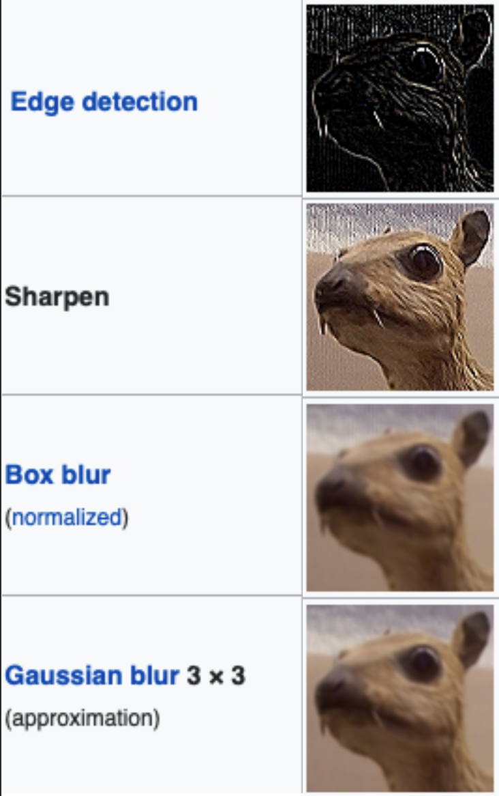

# Image Editor

## Overview
Image Editor is a command-line application for processing and manipulating images. It supports various operations including loading, selecting regions, applying filters, rotating, cropping, and saving images in different formats.



## Features

### Basic Operations
- **Loading images** from files
- **Selecting** specific regions for editing
- **Cropping** images to the selected region
- **Saving** images in normal or ASCII format

### Image Transformations
- **Rotation** by specified angles
- **Histogram** generation with customizable parameters
- **Histogram equalization** for better contrast

### Image Filters
- **Edge detection** - highlights boundaries between objects
- **Sharpen** - enhances details and edges
- **Box blur** (normalized) - smooths the image using a uniform kernel
- **Gaussian blur** - smooths the image with a 3×3 Gaussian kernel

## Commands

### LOAD
Loads an image from the specified file.
```
LOAD filename
```

### SELECT
Selects a region of the image for future operations. You can select the entire image or a specific rectangular region.
```
SELECT ALL
SELECT x1 y1 x2 y2
```

### HISTOGRAM
Generates a histogram with the specified number of stars and bins.
```
HISTOGRAM x y
```
- `x`: number of stars
- `y`: number of bins

### EQUALIZE
Applies histogram equalization to enhance the contrast of the image.
```
EQUALIZE
```

### CROP
Crops the image to the currently selected region.
```
CROP
```

### APPLY
Applies the specified filter to the currently selected region.
```
APPLY EDGE
APPLY SHARPEN
APPLY BLUR
APPLY GAUSSIAN_BLUR
```

### ROTATE
Rotates the selected region by the specified angle (must be a multiple of 90 degrees).
```
ROTATE angle
```

### SAVE
Saves the current image to a file, optionally in ASCII format.
```
SAVE filename
SAVE filename ascii
```

### EXIT
Exits the program and frees allocated memory.
```
EXIT
```

## Implementation Details

The application uses defensive programming to prevent crashes. It verifies that images are properly loaded before performing operations and provides appropriate error messages when necessary.

Memory is dynamically allocated for image data and properly deallocated when the program exits to prevent memory leaks.

Image processing algorithms are implemented using matrix operations, with different filters represented by convolution kernels:
- Edge detection highlights boundaries between different objects or surfaces
- Sharpening enhances fine details 
- Box blur provides a basic smoothing effect
- Gaussian blur creates a more natural-looking blur effect

## Error Handling

The program provides feedback for invalid commands and operations:
- "No image loaded" when trying to operate without a loaded image
- "Invalid command" for unrecognized commands
- "Could not alloc the struct" for memory allocation failures

## Example Usage

```
LOAD cat.ppm
SELECT 100 100 400 300
APPLY EDGE
SAVE edge_cat.ppm
SELECT ALL
ROTATE 90
APPLY GAUSSIAN_BLUR
SAVE blurred_cat.ppm ascii
EXIT
```

This sequence loads an image, selects a region, applies edge detection, saves it, selects the entire image, rotates it 90 degrees, applies a Gaussian blur, saves it in ASCII format, and exits.
